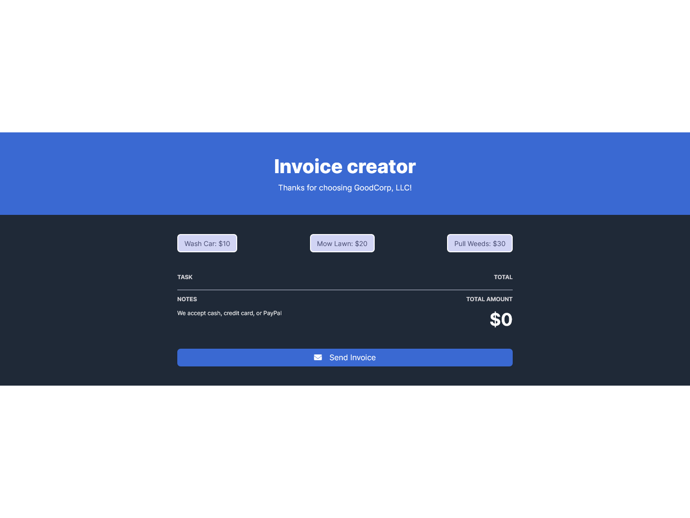
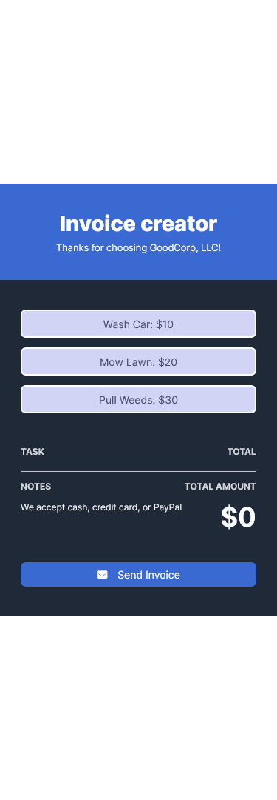
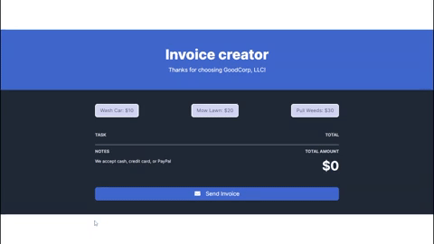

#### Requirements

- Array to hold services requested
- Buttons to add service to array
- Place to display data from array - updated every time the array changes
- Don't charge > once for same service
- Total cost stays updated
- Button to send invoices (reset)

#### Desktop View

#### Mobile View

#### Usage

- Live Site - [Github Pages](https://thaykrgl.github.io/scrimba-mini-projects/invoice-creator/)
